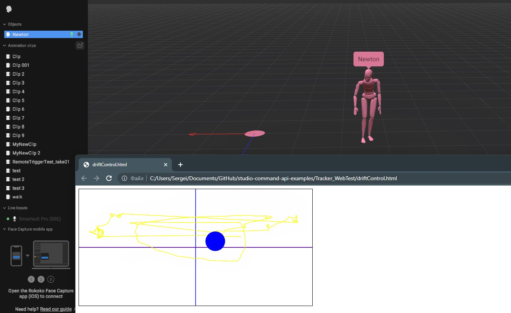
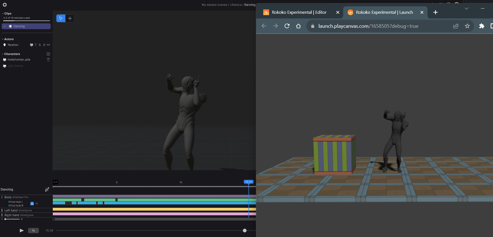

# Studio Command API Examples
Example code of interfacing with the Rokoko Studio Command API

Rokoko Studio offers an API that allows you to operate a running application through a range of commands.

At the moment, the following commands are available - for any of them to work, you need to have a scene open:

* Start/stop recording
* Calibrate
* Reset actor
* Get scene info
* Attach tracker
* Control playback
* Toggle live streaming
* Request an actor or character skeleton

## Setup and sending commands
In order to send commands to and receive messages from Studio, the following values will need to be defined:

* **IP address** (of the computer running Rokoko Studio that you want to interface with)
* **Port** (the port value defined in Rokoko Studio settings; defaults to 14053. This needs to be changed if this port is blocked or used by another application)
* **API key** (the API key defined in Rokoko Studio settings; defaults to 1234)
The command is then sent as a http request in the following format:

http://"IP address":"Port"/v1/"API key"/"command name"

for example

http://127.0.0.1:14053/v1/1234/recording/start

# Commands
## Start/Stop Recording
Used to start and stop a recording

Command: **recording/start** or **recording/stop**

Parameter | Description
--- | ---
filename | The name of the clip you want to record (optional)
time | Timecode in SMPTE format "hh:mm:ss:ff". when it comes to start recording, the timecode will define a recorded clip start time. when it comes to stop recording and timecode provided is not with zeros, the timecode will be used to calculate clip duration and trim the data if required (optional)
frame_rate | Defined framerate for the clip you want to record (optional)
back_to_live | Set to true if you want to stay in "live view" after ending a recording (optional)
 
## Calibrate
Calibrates all paired live input devices in the scene or for the specified actor

Command: **calibrate**

Parameter | Description
--- | ---
device_id | The name/id of the input device, e.g. a Smartsuit Pro, that you want to calibrate (optional) If no value is given, all live devices in the scene will be calibrated
countdown_delay | The countdown in seconds before the actual calibration happens (optional)
skip_suit | If set to true, a paired Smartsuit Pro to the targeted actor will be skipped during calibration (optional)
skip_gloves | If set to true, paired Smartgloves to the targeted actor will be skipped during calibration (optional)
use_custom_pose | If set to true, a custom calibration pose can be used, as defined below (optional)
pose | in case custom pose is used, specify a name of the pose in the listening below (optional)

Values for the pose argument could be the following:
* straight-arms-down
* straight-arms-forward
* tpose (default one)

## Reset Actor
Resets the actor pose and local position

Command: **resetactor**

Parameter | Description
--- | ---
device_id | The name/id of the input device, e.g. a Smartsuit Pro, that is attached to the actor you want to reset

## Toggle Live Stream
Take control of enabled / disabled state of a live stream

Command: **livestream**

Parameter | Description
--- | ---
enabled | pass the true/false value in order to activate or deactivate currently configurated live stream

## Playback
Take control of several properties of playback based on a given control flag

Command: **playback**

Parameter | Description
--- | ---
is_playing | control the play/pause state, only if IsPlaying flag value is provided
current_time | define the current time in seconds, only if CurrentTime flag value is provided
playback_speed | define a playback speed, only if PlaybackSpeed flag value is provided
change_flag | set a bitwise flags to define what changes you want to make over the playback

And playback flags could be following
Parameter | Value | Description
--- | --- | ---
IsPlaying | 1 | control the play/pause state, make a use of is_playing input value
CurrentTime | 2 | make a use of current_time
GoToFirstFrame | 4 | rewind playback to the first frame
GoToLastFrame | 8 | rewind playback to the last frame
PlaybackSpeed | 16 | make a use of playback_speed

## Scene Info
Returns information about the current open scene

Command: **info**

Parameter | Description
--- | ---
devices_info | Set to true if you want information about live input devices in the scene
clips_info | Set to true if you want information about the recorded clips in the scene
actors_info | Set to true if you want information about all actor names in the scene
characters_info | Set to true if you want information about all character names in the scene

## Attach Tracker
Attaches an external tracker, e.g. a HTC Vive Tracker, to an actor, which can then determine its global position.

Command: **tracker**

Parameter | Description
--- | ---
device_id | The name/id of the input device, e.g. a Smartsuit Pro, that is attached to the actor you want to attach the tracker to
bone_attached | The bone that the tracker should be attached to. Defaults to "Hips"
position | Position of the tracker being attached {'X': <value>, 'Y': <value>, 'Z': <value>}
rotation | Rotation of the tracker being attached {'X': <value>, 'Y': <value>, 'Z': <value>, 'W': <value>}
timeout | Time in seconds until the attached tracker releases the attached object (optional)
is_query_only | Use the command to only query a specified bone position and orientation rather than attaching the actual tracker and take control of the bone (optional)

## Skeleton Pose
Do a request to retrieve skeleton hierarchy names and relations, reference pose and motion frame transforms

Command: **pose**

Parameter | Description
--- | ---
name | The name of an actor or a character in the scene
mode | request a 'definition', 'reference' or 'motion'
space | an option for motion frame to define in what space you want to retreive transforms 'local', 'global' or 'localref'

The mode option has values
* definition - in that case, the response will contain bones names and parent relations
* reference - the response will contain position and rotation of each bone in reference pose
* motion - the response will contain hips position and other joint rotations in a defined space provided by a correspondent option

The space option has values:
* local - is return values in joint local space
* global - the response will contain joint transforms in global (world) space
* localref - joint transforms in local space subtracted from a reference pose 

## Python Examples

 In order to run python examples you have to use Python 3.3+ interpreter and you have to install **requests** library - https://pypi.org/project/requests/

## Web Page Drift Control Example

 This is an example of a drift control for the actor. The example is a html web page with java script code.
 The grid on a page shows the ground plane, while a ball represents an actor. 
 
 When you click on a canvas and hold the mouse button, you take control over the actor by sending tracker commands
 When you release the mouse button but keep your mouse in the canvas area, the tracker command continue working in the query mode
 and you will see a yellow trajectory of the actor moving along the ground plane.



## Web Page Pose Example

 This is a test scene in playCanvas with ue5 mannequin. You have to have a Studio scene running with the same character with a name "ue5_many" being imported and paired to newton. In the example a pose command is used in order to request skeleton definition with a list of bone names and hierarchy and with a request of motion frames to translate and rotate joints the same way how it looks in the Studio scene. 

[PlayCanvas Project](https://playcanvas.com/project/1037633/overview/rokoko-experimental)


## Trigger Messages
 
Two-way UDP communication can be used to trigger the start or stop of recording from an external source, or to send recording notifications from the Studio.
 
### Message Format

There are 2 possible notifications to send or receive - start and stop recording.

Notification has a xml based format

Start recording message

```xml
<?xml version="1.0" encoding="UTF-8" standalone="no" ?>
<CaptureStart>
    <Name VALUE="RemoteTriggerTest_take01"/>
    <TimeCode VALUE="00:00:00:00"/>
    <PacketID VALUE="0"/>
    <ProcessID VALUE="optional process id" />
</CaptureStart>
```

Stop recording message

```xml
<?xml version="1.0" encoding="utf-8"?>
<CaptureStop>
    <Name VALUE="TakeName" />
    <TimeCode VALUE="00:00:00:00" />
		<SetActiveClip VALUE="False"/>
    <ProcessID VALUE="optional process id" />
</CaptureStop>
```

The following parameters are used:

- **Name** - Specifies the name of the new clip.
- **TimeCode** - In SMPTE format, this parameter provides values that can be used to align the start recording clip time and stop recording value for the entire clip. This includes the start time offset and duration. Use "00:00:00:00" to indicate that timecode will not be used.
- **SetActiveClip** - Determines whether to enter isolation mode (clip editing mode) or continue in live mode.
- **ProcessID** - Used to verify the owner of the package to avoid reacting to self-broadcasted packages.
 
### Test Python Scripts

Test Python scripts to communicate with trigger messages can be found in TriggerMessages folder.
